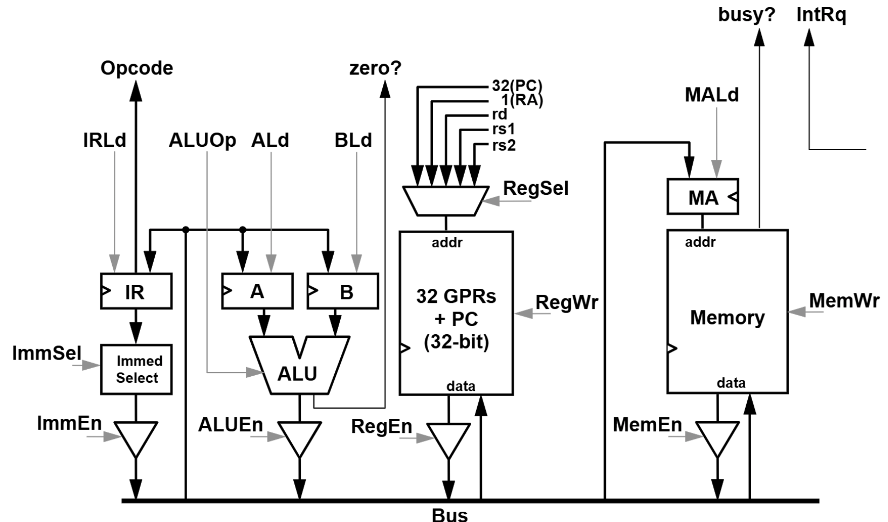

# CS F342 – Computer Architecture Lab 8

## Objective

In this lab, you will implement the control circuit and the microcoded ROM for the multicycle bus-based RISC-V CPU design that we discussed in the class.

---
## Task 1

You are provided with the Verilog implementation for the datapath shown below. The details of the CPU design can be found [here](https://github.com/gsaurabhr-teaching/csf342-material/blob/main/RISC-V%20microcode.pdf).



Write a behavioral control module to work with this datapath (`mult_ctrl.v` with module name `mult_ctrl`). You can follow the discussion from class for implementing the control:  
1. What are the inputs to the control module?
   ```

   ```

2. What are the outputs of the control module? i.e. what control signals are generated?
   ```

   ```

3. Implement the control as a ROM. In task 3, you will fill the ROM with different microinstructions to execute different instructions.

## Task 2

Write a microsequencer that will enable the execution of the microinstructions (`mult_seq.v` with module name `mult_seq`).

1. What does the microsequencer do?
   ```

   ```

2. What are the inputs to the microsequencer?
   ```

   ```

3. Depending on the inputs, the microsequencer will determine the next $\mu PC$. Write the behavioral module accordingly.

## Task 3

Write the microcode for:  
1. Instruction fetch
2. `add` execution
3. `addi` execution
4. `sub` execution
5. `xori` execution
6. `lw` execution
7. `sw` execution
8. `bne` execution

This microcode should be written to the ROM you designed in `Task 1`.

## Task 4

Connect all the above components (datapath components that are given to you already, the control ROM and the microsequencer) to build the final CPU (`mult_cpu.v` with module `mult_cpu`).

## Task 5

Testing your multi-cycle CPU.

Use the same programs that you wrote and assembled in the previous lab (program 1, 2 and 3). Create three test benches like in the previous lab. In each test bench, load the respective machine code into the memory and then start the CPU. Verify the output (i.e. register and memory values) at the end of the programs.